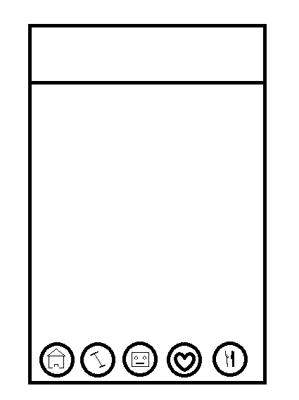
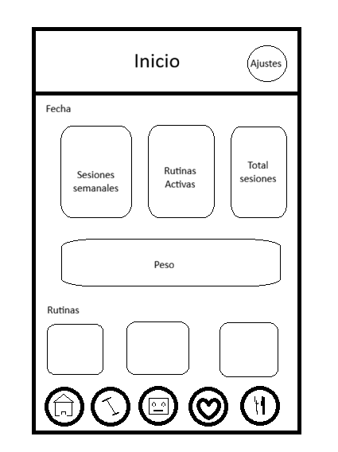
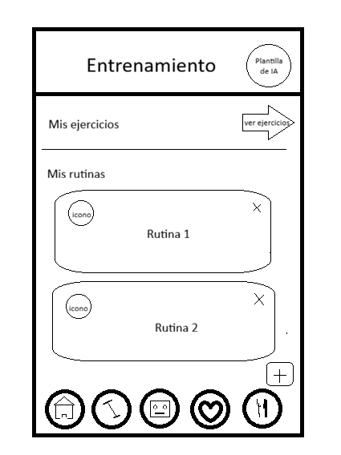
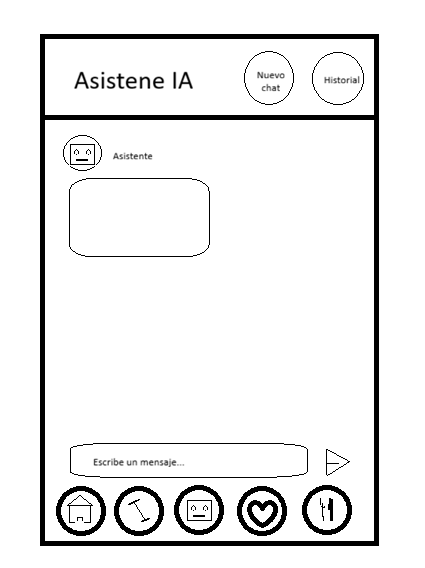
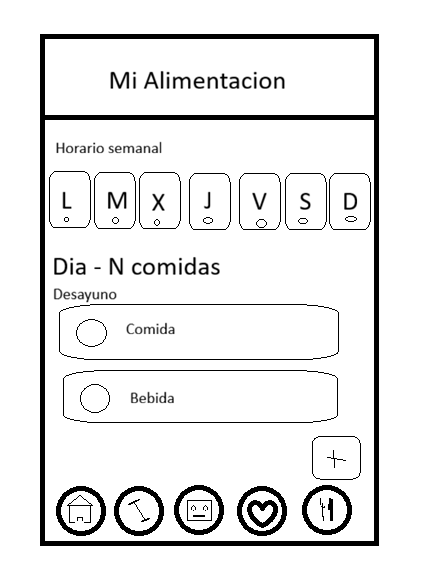
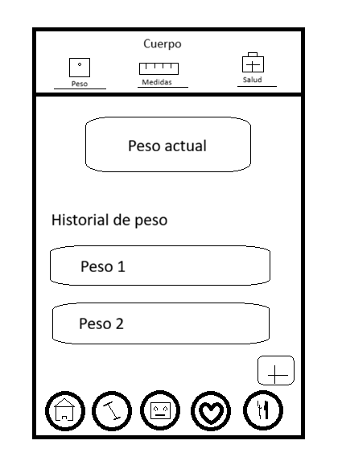
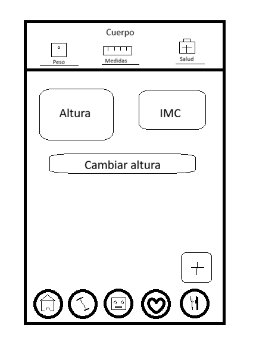
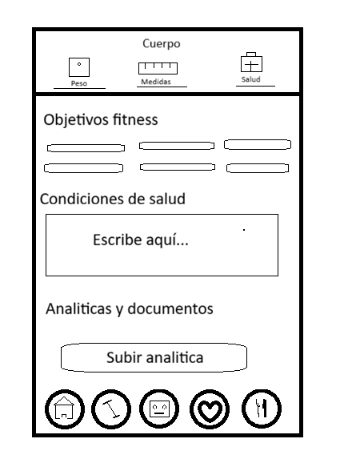

# FitAI – Aplicación Android de Fitness Inteligente con IA

<div align="center">


**Trabajo de Fin de Grado – Desarrollo de Aplicaciones Multiplataforma**  
**Autor:** Carlos Carame Cerero  
**Fecha:** Mayo 2026  
**Versión:** 2.3

</div>

---

## Índice

1. [Introducción](#1-introducción)
   - [Justificación del proyecto](#11-justificación-del-proyecto)
   - [Análisis comparativo](#12-análisis-comparativo-de-aplicaciones-similares)
   - [Tendencias](#13-tendencias)
   - [Beneficios esperados](#14-beneficios-y-expectativas)
2. [Descripción del proyecto](#2-descripción-del-proyecto)
   - [Tipo de proyecto](#21-tipo-de-proyecto)
   - [Características principales](#22-características-principales)
   - [Usuarios destinatarios](#23-usuarios-destinatarios)
3. [Objetivos del proyecto](#3-objetivos-del-proyecto)
4. [Alcance del proyecto](#4-alcance-del-proyecto)
5. [Requisitos del proyecto](#5-requisitos-del-proyecto)
6. [Planificación del proyecto](#6-planificación-del-proyecto)
7. [Plan de gestión de riesgos](#7-plan-de-gestión-de-riesgos)
8. [Diseño](#8-diseño)
   - [Prototipado (wireframes)](#81-prototipado-wireframes)
   - [Especificaciones técnicas](#82-especificaciones-técnicas)
   - [Diagramas UML](#83-diagramas-uml)
   - [Diseño de la base de datos](#84-diseño-de-la-base-de-datos)
   - [Comparativa acceso a datos](#86-gestión-de-la-información-y-comparativa-de-acceso-a-datos)
   - [Diseño de la API – Gemini](#85-diseño-de-la-api--google-gemini)
9. [Instalación y preparación](#9-instalación-y-preparación)
10. [Documentación de ejecución y plan de calidad](#10-documentación-de-ejecución-y-plan-de-calidad)
    - [Procedimientos operativos](#101-procedimientos-operativos)
    - [Registro de pruebas](#102-registro-de-pruebas)
    - [Indicadores de calidad](#103-indicadores-de-calidad)
    - [Métodos de verificación](#104-métodos-de-verificación)
    - [Pruebas de usabilidad con usuarios](#105-pruebas-de-usabilidad-con-usuarios-reales)
11. [Distribución](#11-distribución)
12. [Manuales](#12-manuales)
13. [Conclusiones](#13-conclusiones)
14. [Anexos](#14-anexos)
15. [Índice de tablas e imágenes](#15-índice-de-tablas-e-imágenes)
16. [Bibliografía y referencias](#16-bibliografía-y-referencias)

---

## 1. Introducción

### 1.1 Justificación del proyecto

La idea de **FitAI** surge de una necesidad real detectada en el mercado de aplicaciones de fitness: la mayoría de apps existentes ofrecen funcionalidades de seguimiento básico (registro de ejercicios, conteo de calorías), pero **ninguna integra de forma nativa un asistente de inteligencia artificial conversacional** que conozca en profundidad el perfil del usuario, su historial de entrenamientos, su alimentación y sus documentos médicos.

El usuario medio que se toma en serio su forma física necesita gestionar varias apps distintas (un diario de entrenamiento, una app de nutrición, un chat con su entrenador personal) o pagar servicios de suscripción premium muy costosos. FitAI centraliza todas estas necesidades en una sola aplicación gratuita, potenciada por IA generativa de última generación (Google Gemini 2.5 Flash).

Adicionalmente, el crecimiento exponencial de los modelos de lenguaje grandes (LLMs) y su disponibilidad a través de APIs REST asequibles abre la puerta a integrar inteligencia artificial en proyectos móviles de tamaño medio, algo que hace apenas dos años era exclusivo de grandes empresas tecnológicas.

### 1.2 Análisis comparativo de aplicaciones similares

| Característica | FitAI | MyFitnessPal | Hevy | Strong | Freeletics |
|---|---|---|---|---|---|
| Registro de entrenamientos | ✅ | ❌ | ✅ | ✅ | ✅ |
| Registro nutricional | ✅ | ✅ | ❌ | ❌ | Parcial |
| Seguimiento corporal | ✅ | Parcial | ❌ | ❌ | ❌ |
| Asistente IA conversacional | ✅ | ❌ | ❌ | ❌ | Básico |
| IA crea rutinas/comidas | ✅ | ❌ | ❌ | ❌ | ❌ |
| Análisis documentos médicos | ✅ | ❌ | ❌ | ❌ | ❌ |
| Datos 100% locales (sin cloud) | ✅ | ❌ | ❌ | ❌ | ❌ |
| Código abierto / TFG | ✅ | ❌ | ❌ | ❌ | ❌ |
| Precio | Gratis | Freemium | Freemium | Freemium | Freemium |

**Conclusión del análisis:** Ninguna aplicación del mercado combina en un único producto las cuatro dimensiones de seguimiento (entrenamiento, nutrición, cuerpo, documentos médicos) con un asistente IA contextualizado y capacidad de creación autónoma de contenido. FitAI cubre ese hueco.

### 1.3 Tendencias

El proyecto se enmarca en tres grandes tendencias tecnológicas actuales:

1. **IA Generativa en aplicaciones móviles:** Tras el lanzamiento de GPT-4 y Gemini, los desarrolladores están integrando LLMs directamente en apps móviles. Se estima que el mercado de IA en fitness alcanzará los 40.000 millones de dólares en 2030 (MarketsandMarkets, 2024).

2. **Personalización extrema del fitness:** Los usuarios exigen planes de entrenamiento y nutrición adaptados a su genética, patologías y objetivos personales, no plantillas genéricas.

3. **Privacidad y datos locales:** El auge de regulaciones como el RGPD impulsa soluciones donde los datos sensibles de salud se almacenan exclusivamente en el dispositivo del usuario, sin servidores externos.

### 1.4 Beneficios y expectativas

- **Para el usuario:** Disponer de un entrenador personal y nutricionista virtual disponible 24/7, que conoce su historial completo y puede actuar sobre la app directamente.
- **Para el desarrollador:** Demostrar la viabilidad técnica de integrar arquitecturas modernas de Android (MVVM + Clean Architecture + Hilt + Compose) con servicios de IA de última generación.
- **Para el TFG:** Presentar un proyecto funcional, completo y diferenciador que demuestre competencias avanzadas en desarrollo Android nativo.

---

## 2. Descripción del proyecto

### 2.1 Tipo de proyecto

FitAI es una **aplicación Android nativa** desarrollada en **Kotlin** con **Jetpack Compose**, orientada al seguimiento integral de la salud y el rendimiento físico personal. Incorpora un asistente de inteligencia artificial conversacional (Google Gemini 2.5 Flash) con capacidad de lectura y escritura sobre todos los módulos de la app.

- **Plataforma:** Android (minSdk 24 – Android 7.0 Nougat, targetSdk 36)
- **Lenguaje:** Kotlin 2.0.21
- **Paradigma:** MVVM + Clean Architecture
- **Almacenamiento:** 100% local (Room/SQLite + DataStore)
- **Servicio externo:** Google Gemini API REST (solo para IA)

### 2.2 Características principales

#### Módulo de Entrenamiento
- Gestión completa de rutinas de entrenamiento (crear, editar, eliminar)
- Biblioteca de ejercicios personalizada con filtros por grupo muscular y tipo (fuerza/cardio)
- Registro de sesiones en tiempo real con **temporizador de descanso editable** (modo cuenta atrás, configurable en cualquier momento durante la sesión pulsando la tarjeta de descanso) o **cronómetro** (modo cuenta progresiva); el tiempo de descanso por defecto es 60 s y no requiere configuración previa al iniciar la sesión
- **Notificación persistente en segundo plano** durante el descanso (foreground service), visible aunque la app esté minimizada o la pantalla bloqueada
- Seguimiento de series, repeticiones, peso (fuerza) y tiempo/distancia (cardio)
- Historial completo de sesiones por rutina

#### Módulo de Nutrición
- **Múltiples horarios de comidas independientes**: el usuario puede crear, nombrar y gestionar tantos horarios como necesite (p. ej. "Mi dieta", "Volumen", "Cutting") sin perder los datos de los anteriores; cada horario se activa con un solo toque desde la pantalla de gestión (`MealSchedulesScreen`)
- El horario activo se muestra en la cabecera de la pantalla de Nutrición con acceso directo a "Gestionar"
- Horario semanal de comidas organizado por día y tipo (desayuno, almuerzo, cena, snack)
- Registro de macronutrientes (calorías, proteínas, hidratos, grasas)
- Diferenciación entre comidas sólidas y bebidas

#### Módulo Corporal
- Registro histórico de peso con evolución gráfica
- Seguimiento de medidas corporales (pecho, cintura, cadera, bíceps, muslos)
- Perfil de usuario con datos de salud y objetivos fitness
- Gestión de documentos médicos en PDF (analíticas, informes)

#### Asistente IA
- Chat conversacional con Google Gemini 2.5 Flash
- Respuestas en streaming (efecto de escritura en tiempo real)
- Contexto personalizado: el asistente conoce el perfil, historial, nutrición, medidas y documentos del usuario
- **Análisis nativo de documentos PDF médicos**: los archivos se envían directamente a Gemini como `inline_data` (sin extracción de texto previa), lo que permite al modelo leer analíticas, informes y resultados médicos con total fidelidad independientemente del formato o codificación del PDF
- Formato rico: negritas con `**texto**`
  - **Creación autónoma** de rutinas, ejercicios y nuevos horarios nutricionales completos — la IA siempre genera un **horario nuevo** (nombre `"IA – dd/MM/yyyy"`) sin sobreescribir los horarios existentes del usuario; el nuevo horario aparece automáticamente en `MealSchedulesScreen`
- Validación anti-duplicados antes de crear cualquier elemento
- Historial de conversaciones guardado

#### Módulo de Ajustes
- Tema claro/oscuro/automático (persistido en DataStore)
- Recordatorios diarios de entrenamiento (WorkManager)
- Permisos de creación del asistente IA (rutinas, ejercicios, horario)
- **Copia de seguridad completa de la BD** (`.db`): exporta toda la base de datos SQLite con checkpoint WAL garantizado e importa/restaura desde un archivo `.db` previo con reinicio automático de la app
- **Exportación de datos en CSV** (sesiones resumen, **sesiones detalladas con sets**, peso, nutrición, rutinas, ejercicios) con formato compatible con Excel en español (separador `;` + BOM UTF-8)
- **Importación de datos desde CSV** (peso, nutrición, rutinas, ejercicios, **sesiones detalladas**) con detección automática de tipo por cabecera
- **Registro de auditoría de acciones** (AuditLogScreen): historial completo de operaciones realizadas por módulo, con filtros por categoría y posibilidad de limpiar el registro
- **Bloqueo biométrico de la app**: protección opcional mediante huella dactilar o desbloqueo facial al abrir o retomar la aplicación; período de gracia inteligente que evita interrumpir el temporizador de descanso activo
- **Pantalla de ayuda integrada** (HelpScreen): guía accordion paso a paso de cada módulo de la app
- **Pantalla de Términos y Condiciones**: presentada obligatoriamente en el primer arranque; consultable en modo solo lectura desde Ajustes en cualquier momento; aceptación registrada en DataStore

#### UX y Accesibilidad
- **Transiciones animadas de navegación** (slide horizontal + fade, 280 ms) entre todas las pantallas del NavHost
- **Feedback háptico** al pulsar el FAB y al cambiar de pestaña en la barra de navegación inferior
- **Mensajes de estado vacío mejorados** (EmptyStateMessage): animación de entrada con escala + fundido, soporte para subtítulo opcional, fondo Card semitransparente

#### Dashboard
- Resumen rápido: peso actual, sesiones de la semana, rutinas activas
- Acceso directo a consejos IA (FAB flotante)
- **Acceso rápido (4 acciones):** "Añadir peso" (diálogo inline), "Salud" (navega a la pestaña Salud del módulo Cuerpo), "Guía" (abre la pantalla de ayuda), "Exportar" (abre Ajustes)
- **Tus rutinas:** muestra las últimas 3 rutinas en las que se registró una sesión, ordenadas por fecha de uso más reciente; pulsando la card se navega directamente al detalle de la rutina

### 2.3 Usuarios destinatarios

| Perfil | Descripción |
|---|---|
| **Deportista amateur** | Persona que entrena regularmente en gimnasio o en casa sin entrenador personal |
| **Persona en proceso de mejora física** | Usuario que quiere perder peso, ganar masa muscular o mejorar su condición física |
| **Persona con condiciones de salud** | Usuario con patologías documentadas (analíticas, informes médicos) que necesita un seguimiento personalizado |
| **Estudiante / joven adulto** | Perfil tecnológico, cómodo con apps móviles, que busca una solución gratuita y completa |

**Perfil mínimo técnico:** Android 7.0 o superior, conexión a internet para el asistente IA.

---

## 3. Objetivos del proyecto

### 3.1 Objetivo general

Desarrollar una aplicación Android nativa completa que centralice el seguimiento de entrenamiento, nutrición y composición corporal, integrando un asistente de inteligencia artificial conversacional capaz de actuar sobre los datos del usuario de forma contextualizada y con permisos configurables.

### 3.2 Objetivos específicos

#### Módulo de Entrenamiento
- OE-01: Implementar un sistema CRUD completo de rutinas y ejercicios personalizados
- OE-02: Registrar sesiones de entrenamiento con series, repeticiones y pesos en tiempo real
- OE-03: Ofrecer un historial de sesiones por rutina con estadísticas básicas

#### Módulo de Nutrición
- OE-04: Implementar un horario semanal de comidas con macronutrientes
- OE-05: Diferenciar correctamente entre tipos de ingesta (sólidos vs. bebidas)
- OE-06: Permitir establecer y visualizar objetivos nutricionales diarios

#### Módulo Corporal
- OE-07: Registrar y visualizar el historial de peso corporal
- OE-08: Gestionar medidas corporales con evolución temporal
- OE-09: Permitir adjuntar documentos PDF médicos vinculados al perfil

#### Asistente IA
- OE-10: Integrar Google Gemini 2.5 Flash con streaming de respuestas
- OE-11: Construir un contexto personalizado que incluya todos los datos del usuario
- OE-12: Implementar un sistema de acciones que permita al asistente crear contenido en la app
- OE-13: Validar duplicados antes de cualquier creación autónoma por parte de la IA
- OE-14: Implementar control de tasa local (rate limiting) para proteger la API key

#### Técnicos y transversales
- OE-15: Aplicar arquitectura MVVM + Clean Architecture con Hilt como IoC
- OE-16: Almacenar todos los datos de salud exclusivamente en el dispositivo (privacidad)
- OE-17: Implementar tema dinámico oscuro/claro con Material Design 3
- OE-18: Proveer exportación e importación de datos en formato CSV
- OE-19: Implementar un **registro de auditoría** que documente todas las operaciones relevantes del usuario (creación, eliminación, cambios de configuración, exportaciones)

---

## 4. Alcance del proyecto

### 4.1 Qué incluye

| Área | Incluido |
|---|---|
| Gestión de rutinas y ejercicios | ✅ CRUD completo + selección múltiple |
| Registro de sesiones en tiempo real | ✅ Con temporizador de descanso / cronómetro |
| Notificación de temporizador en 2.º plano | ✅ Foreground service + pantalla bloqueada |
| Historial de sesiones por rutina | ✅ |
| Horario semanal de nutrición | ✅ Con macros y tipos |
| Seguimiento de peso y medidas | ✅ Con gráficas |
| Documentos PDF médicos | ✅ Adjuntar y extraer texto |
| Asistente IA conversacional | ✅ Streaming + historial |
| Creación autónoma por IA | ✅ Rutinas, ejercicios, horario (con permisos) |
| Validación anti-duplicados IA | ✅ |
| Exportación CSV | ✅ Sesiones (resumen y detallado con sets), peso, nutrición, rutinas y ejercicios |
| Importación CSV | ✅ Peso, nutrición, rutinas, ejercicios y sesiones detalladas (con detección automática) |
| Copia de seguridad completa (.db) | ✅ Exportar y restaurar toda la BD con checkpoint WAL + reinicio automático |
| Registro de auditoría (AuditLog) | ✅ Por módulo, filtrable, con limpieza |
| Pantalla de ayuda integrada | ✅ Accordion paso a paso, accesible desde Ajustes |
| Notificaciones diarias | ✅ WorkManager |
| Tema oscuro/claro | ✅ DataStore |
| Navegación con 5 pestañas | ✅ Dashboard, Entreno, Asistente, Cuerpo, Nutrición |
| Términos y Condiciones | ✅ Primer arranque + consulta desde Ajustes |
| Transiciones de navegación animadas | ✅ Slide + fade 280 ms en todo el NavHost |
| Feedback háptico | ✅ FAB y barra de navegación inferior |
| EmptyStateMessage mejorado | ✅ Animación entrada, subtítulo, fondo Card |

### 4.2 Qué queda fuera del alcance

| Área | Motivo de exclusión |
|---|---|
| Backend propio / servidor en la nube | Complejidad fuera del tiempo disponible; toda la persistencia es local |
| Sincronización entre dispositivos | Requeriría backend con autenticación |
| Análisis nutricional automático por foto | Requeriría visión artificial dedicada |
| Reconocimiento de voz | Fuera del alcance del TFG |
| Integración con wearables (smartwatch) | APIs de terceros complejas |
| Publicación en Google Play Store | Requiere cuenta de desarrollador ($25) |
| Planes de nutrición basados en alimentos de una base de datos externa | Se optó por registro manual para privacidad |

### 4.3 Restricciones

- **Tiempo:** Desarrollo individual en ~3 meses (febrero–mayo 2026)
- **Equipo:** Desarrollador único
- **Coste:** Cero (API gratuita de Gemini con límites de uso; sin servidor)
- **Privacidad:** Los datos de salud **no salen del dispositivo** excepto las consultas al asistente IA

---

## 5. Requisitos del proyecto

### 5.1 Requisitos funcionales

| ID | Requisito | Módulo | Prioridad |
|---|---|---|---|
| RF-01 | El sistema permitirá crear, editar y eliminar rutinas de entrenamiento | Entrenamiento | Alta |
| RF-02 | El sistema permitirá crear, editar y eliminar ejercicios con tipo y grupo muscular | Entrenamiento | Alta |
| RF-03 | El sistema permitirá añadir múltiples ejercicios a una rutina en una sola operación | Entrenamiento | Alta |
| RF-04 | El sistema registrará sesiones de entrenamiento con series, repeticiones y pesos | Entrenamiento | Alta |
| RF-05 | El sistema mostrará el historial de sesiones de cada rutina | Entrenamiento | Media |
| RF-06 | El sistema permitirá registrar comidas en un horario semanal con macronutrientes | Nutrición | Alta |
| RF-07 | El sistema diferenciará entre comidas sólidas y bebidas | Nutrición | Media |
| RF-08 | El sistema registrará el peso corporal con histórico y evolución | Cuerpo | Alta |
| RF-09 | El sistema permitirá adjuntar documentos PDF médicos y extraer su texto | Cuerpo | Media |
| RF-10 | El asistente IA responderá en tiempo real con efecto de escritura (streaming) | Asistente | Alta |
| RF-11 | El asistente IA tendrá acceso al perfil, historial y documentos del usuario | Asistente | Alta |
| RF-12 | El asistente IA podrá crear rutinas, ejercicios y comidas si tiene permiso | Asistente | Alta |
| RF-13 | El sistema validará que la IA no cree elementos duplicados | Asistente | Alta |
| RF-14 | El sistema permitirá configurar permisos individuales de creación para la IA | Ajustes | Media |
| RF-15 | El sistema exportará los datos en formato CSV (sesiones resumen, sesiones detalladas con sets, peso, nutrición, rutinas, ejercicios) | Ajustes | Baja |
| RF-16 | El sistema permitirá exportar y restaurar la base de datos SQLite completa (.db) con checkpoint WAL y reinicio automático | Ajustes | Baja |
| RF-17 | El sistema enviará recordatorios diarios de entrenamiento | Ajustes | Baja |
| RF-18 | El dashboard mostrará un resumen del estado actual del usuario, accesos rápidos (añadir peso, salud, guía, exportar) y las últimas 3 rutinas con sesión registrada ordenadas por fecha de uso | Dashboard | Media |
| RF-19 | El sistema registrará automáticamente todas las acciones relevantes del usuario en un registro de auditoría (AuditLog) consultable por módulo | Ajustes | Media |
| RF-20 | La app presentará los Términos y Condiciones en el primer arranque y requerirá su aceptación para continuar; serán consultables desde Ajustes | Ajustes | Alta |

### 5.2 Requisitos técnicos (no funcionales)

| ID | Requisito | Categoría |
|---|---|---|
| RNF-01 | La aplicación se ejecutará en Android 7.0 (API 24) o superior | Compatibilidad |
| RNF-02 | Todos los datos de salud se almacenarán exclusivamente en el dispositivo local | Privacidad |
| RNF-03 | Las consultas al asistente IA contarán con rate limiting (10/min, 500/día) | Seguridad |
| RNF-04 | La API key de Gemini se almacenará en `local.properties` (fuera del VCS) | Seguridad |
| RNF-05 | La app responderá en menos de 200ms a cualquier acción de UI local | Rendimiento |
| RNF-06 | Las consultas a Room se realizarán en corrutinas fuera del hilo principal | Rendimiento |
| RNF-07 | La interfaz seguirá las guías de Material Design 3 | Usabilidad |
| RNF-08 | La app soportará tema oscuro y claro con cambio persistente | Usabilidad |
| RNF-09 | El código seguirá la arquitectura MVVM + Clean Architecture | Mantenibilidad |
| RNF-10 | La inyección de dependencias se gestionará con Hilt | Mantenibilidad |
| RNF-11 | Las pantallas se implementarán con Jetpack Compose declarativo | Mantenibilidad |
| RNF-12 | El acceso a la app podrá protegerse con autenticación biométrica (huella/face); período de gracia inteligente evita re-autenticaciones durante el temporizador de descanso activo | Seguridad |
| RNF-13 | La interfaz proporcionará feedback háptico (vibración táctil) al interactuar con el FAB y la barra de navegación inferior | Usabilidad |

### 5.3 Requisitos legales y normativos

| Requisito | Descripción |
|---|---|
| **RGPD (Reglamento General de Protección de Datos)** | Los datos de salud (categoría especial) se almacenan localmente; no se transmiten a servidores propios. El único servicio externo es la API de Gemini de Google, cubierta por la política de privacidad de Google Cloud. |
| **Política de uso de Gemini API** | La aplicación respeta los límites de uso gratuito de la API y los Términos de Servicio de Google AI Studio. |
| **Permisos de Android** | La app solicita únicamente los permisos estrictamente necesarios: `POST_NOTIFICATIONS` (Android 13+), `READ_EXTERNAL_STORAGE` (para PDFs), `INTERNET` (para Gemini), `USE_BIOMETRIC` / `USE_FINGERPRINT` (bloqueo biométrico opcional). |
| **Licencia de dependencias** | Todas las librerías utilizadas (Apache 2.0, MIT) permiten uso libre incluyendo proyectos académicos. |

---

## 6. Planificación del proyecto

### 6.1 Estructura de tareas (WBS)

```
FitAI – TFG
├── F1. Análisis y requisitos
│   ├── F1.1 Estudio de mercado y apps similares
│   ├── F1.2 Definición de requisitos funcionales
│   ├── F1.3 Identificación de actores y casos de uso
│   └── F1.4 Definición del alcance
│
├── F2. Diseño del sistema
│   ├── F2.1 Arquitectura MVVM + Clean Architecture
│   ├── F2.2 Diseño del esquema de base de datos
│   ├── F2.3 Diagramas UML (casos de uso, clases, secuencia)
│   ├── F2.4 Wireframes de pantallas principales
│   └── F2.5 Diseño del sistema de acciones IA
│
├── F3. Implementación – Infraestructura
│   ├── F3.1 Configuración del proyecto (Gradle, Hilt, Room)
│   ├── F3.2 Definición de entidades Room (14 entidades)
│   ├── F3.3 Implementación de DAOs (12)
│   ├── F3.4 Módulos Hilt (Database, Repository, AI)
│   └── F3.5 Navegación Compose (NavHost + BottomBar)
│
├── F4. Implementación – Módulos funcionales
│   ├── F4.1 Módulo de Entrenamiento (rutinas, ejercicios, sesiones)
│   ├── F4.2 Módulo de Nutrición (horario, macros, objetivos)
│   ├── F4.3 Módulo Corporal (peso, medidas, perfil, PDF)
│   ├── F4.4 Dashboard e inicio
│   └── F4.5 Ajustes (tema, notificaciones, exportación)
│
├── F5. Implementación – Asistente IA
│   ├── F5.1 Integración Gemini API REST con OkHttp
│   ├── F5.2 Streaming SSE (respuesta en tiempo real)
│   ├── F5.3 System prompt contextualizado
│   ├── F5.4 Sistema de acciones [ACTION:TIPO]{json}[/ACTION]
│   ├── F5.5 Validación anti-duplicados
│   └── F5.6 Rate limiting local
│
├── F6. Mejoras de UI/UX
│   ├── F6.1 Animaciones (transiciones, loading, FAB)
│   ├── F6.2 Tema dinámico Material Design 3
│   └── F6.3 Corrección de bugs de navegación
│
└── F7. Documentación
    ├── F7.1 Entrega 2 – Análisis y requisitos
    ├── F7.2 Entrega 3 – Diseño del sistema
    ├── F7.3 Entrega 4 – Implementación
    └── F7.4 README y memoria final
```

### 6.2 Cronograma (Diagrama de Gantt)

```
TAREA                              ENE    FEB    MAR    ABR    MAY
                                   1  2  3  4  1  2  3  4  1  2  3  4  1  2  3  4  1  2
F1. Análisis y requisitos          ████████
F2. Diseño del sistema                   ████████
F3. Infraestructura (DB, Hilt)                 ████████
F4.1 Módulo Entrenamiento                         ████████
F4.2 Módulo Nutrición                                   ████
F4.3 Módulo Corporal                                    ████
F4.4 Dashboard                                       ████
F4.5 Ajustes                                              ████
F5. Asistente IA                                    ████████████
F6. Mejoras UI/UX y bugs                                   ████████
F7. Documentación                  ██   ██   ██   ██████████████
```

### 6.3 Recursos necesarios

| Recurso | Descripción | Coste |
|---|---|---|
| **Android Studio Ladybug** | IDE oficial para desarrollo Android | Gratis |
| **Kotlin 2.0.21** | Lenguaje de programación | Gratis |
| **Google Gemini API** | Servicio de IA generativa | Gratis (límites gratuitos) |
| **Dispositivo Android** | Para pruebas físicas | Hardware propio |
| **Emulador Android** | Para pruebas en distintas versiones | Incluido en Android Studio |
| **Git + GitHub** | Control de versiones | Gratis |
| **Figma** | Wireframes y diseño UI | Gratis (plan básico) |

---

## 7. Plan de gestión de riesgos

### 7.1 Identificación y evaluación de riesgos

| ID | Riesgo | Probabilidad | Impacto | Nivel |
|---|---|---|---|---|
| R-01 | Cambios en la API de Gemini (deprecación de modelos) | Media | Alto | 🔴 Alto |
| R-02 | Límite de cuota gratuita de la API de Gemini agotada | Alta | Medio | 🟡 Medio |
| R-03 | Migración destructiva de base de datos (pérdida de datos) | Media | Alto | 🔴 Alto |
| R-04 | Incompatibilidad con versiones antiguas de Android | Baja | Medio | 🟢 Bajo |
| R-05 | Tiempo insuficiente para completar todos los módulos | Media | Alto | 🔴 Alto |
| R-06 | Respuestas incorrectas o alucinaciones de la IA | Alta | Medio | 🟡 Medio |
| R-07 | Pérdida del repositorio o código fuente | Baja | Alto | 🟡 Medio |
| R-08 | Performance pobre en dispositivos de gama baja | Media | Medio | 🟡 Medio |

### 7.2 Recursos preventivos y plan de mitigación

| ID | Medida preventiva | Plan de contingencia |
|---|---|---|
| R-01 | Encapsular la lógica de Gemini en `GeminiService.kt` (un único punto de cambio) | Actualizar el endpoint/modelo; la arquitectura permite hacerlo en minutos |
| R-02 | Implementar `ApiRateLimiter` con persistencia local (10 req/min, 500/día) | Mostrar mensaje descriptivo al usuario con tiempo de espera restante |
| R-03 | Exportar esquemas JSON de Room (`exportSchema = true`) | `fallbackToDestructiveMigration()` durante desarrollo; escribir migraciones para producción |
| R-04 | Fijar `minSdk = 24` (cubre >97% de dispositivos activos) | Testar en emuladores API 24 y 26 regularmente |
| R-05 | Priorizar módulos core (entrenamiento y asistente); el resto es incremental | Definir MVP mínimo funcional y dedicar las últimas semanas a polish |
| R-06 | Validación en código de todo lo que la IA genera (tipos, duplicados, campos) | Sistema de inferencia automática como segunda capa de seguridad |
| R-07 | Repositorio en GitHub con commits frecuentes y descriptivos | Tener una copia local en disco externo actualizada semanalmente |
| R-08 | Usar `StateFlow.WhileSubscribed(5000)`, cancelar corrutinas inactivas | Perfilar con Android Profiler; reducir recomposiciones innecesarias |

---

## 8. Diseño

### 8.1 Prototipado – Wireframes

> Las capturas de pantalla reales se adjuntan en el anexo gráfico de la memoria.

La navegación principal se articula en torno a una **barra inferior con 5 pestañas**, con el botón del Asistente IA destacado en el centro:

**Base / estructura general**




**Pantallas principales implementadas:**

| Pantalla | Descripción |
|---|---|
| **Dashboard** | Resumen: peso actual, sesiones de la semana, rutinas activas. Accesos rápidos: añadir peso (diálogo inline), salud, guía y exportar. Últimas 3 rutinas usadas. FAB de consejos IA |
| **Entrenamiento** | Lista de rutinas con sus ejercicios. Botón nueva rutina y acceso a biblioteca |
| **Detalle de rutina** | Ejercicios asignados, historial de sesiones, iniciar nueva sesión directamente (sin diálogo previo) |
| **Sesión activa** | Registro de series con temporizador de descanso (60 s por defecto, editable pulsando la tarjeta) |
| **Biblioteca de ejercicios** | Catálogo con filtros; pulsando la card se edita el ejercicio |
| **Asistente IA** | Chat con streaming. Negritas, acciones, historial de conversaciones |
| **Cuerpo** | Peso, medidas, perfil, documentos PDF |
| **Nutrición** | Horario semanal de comidas con macronutrientes |
| **Ajustes** | Tema, notificaciones, permisos IA, exportación CSV, pantalla de ayuda |

#### Galería de wireframes (orden de navegación)

**Inicio (Dashboard)**



**Entrenamiento**



**Asistente IA**



**Nutrición**



**Cuerpo - Peso**



**Cuerpo - Medidas**



**Cuerpo - Salud**



### 8.2 Especificaciones técnicas

#### Arquitectura del sistema

```
┌───────────────────────────────────────────────────────────────┐
│                   CAPA DE PRESENTACIÓN (UI)                   │
│          Jetpack Compose + Material3 + Navigation Compose     │
│                    screens/ + components/                     │
├───────────────────────────────────────────────────────────────┤
│                         VIEWMODELS                            │
│            @HiltViewModel + StateFlow + Coroutines            │
│                         viewmodel/                            │
├───────────────────────────────────────────────────────────────┤
│                      CAPA DE DOMINIO                          │
│            Interfaces de repositorio (contratos puros)        │
│                      domain/repository/                       │
├───────────────────────────────────────────────────────────────┤
│                      CAPA DE DATOS                            │
│        Implementaciones + DAOs Room + GeminiService           │
│            data/repository/ + data/local/ + data/remote/      │
├───────────────────────────────────────────────────────────────┤
│                    FUENTES DE DATOS                           │
│  SQLite (Room v10) │ Gemini API REST │ DataStore │ WorkManager│
└───────────────────────────────────────────────────────────────┘
```

#### Stack tecnológico

| Capa | Tecnología | Versión |
|---|---|---|
| Lenguaje | Kotlin | 2.0.21 |
| UI | Jetpack Compose + Material3 | BOM 2024.09.00 |
| Arquitectura | MVVM + Clean Architecture | — |
| Inyección de dependencias | Hilt (Dagger) | 2.51.1 |
| Base de datos local | Room (SQLite) | 2.7.1 |
| Navegación | Navigation Compose | 2.8.5 |
| Procesado de anotaciones | KSP | 2.0.21-1.0.27 |
| IA Generativa | Google Gemini 2.5 Flash (REST) | — |
| HTTP Client | OkHttp | 4.12.0 |
| Serialización | Gson | 2.11.0 |
| Tareas en segundo plano | WorkManager | 2.10.1 |
| Preferencias | DataStore Preferences | 1.1.4 |
| Gradle Plugin | Android AGP | 8.13.2 |
| SDK mínimo / objetivo | Android | 24 / 36 |
| Tests unitarios (mocking) | MockK | 1.13.12 |
| Tests unitarios (Flow/coroutines) | kotlinx-coroutines-test + Turbine | 1.9.0 / 1.2.0 |
| Tests instrumentados (BD) | Room Testing (in-memory) | 2.7.1 |
| Diseño adaptativo | WindowSizeClass (Material3) | BOM 2024.09.00 |
| OCR (fallback PDFs escaneados) | ML Kit Text Recognition | 16.0.1 |

### 8.3 Diagramas UML

#### 8.3.1 Diagrama de casos de uso

```
                    ┌──────────────────────────────────────────────┐
                    │                  Sistema FitAI               │
                    │                                              │
                    │  ┌─────────────────────────────────────────┐ │
                    │  │          MÓDULO ENTRENAMIENTO           │ │
                    │  │  (UC-01) Gestionar rutinas              │ │
                    │  │  (UC-02) Gestionar ejercicios           │ │
         ┌──────┐   │  │  (UC-03) Registrar sesión               │ │
         │      │───┼──│  (UC-04) Ver historial sesiones         │ │
         │      │   │  └─────────────────────────────────────────┘ │
         │      │   │                                              │
         │      │   │  ┌─────────────────────────────────────────┐ │
         │Usuario   │  │          MÓDULO NUTRICIÓN               │ │
         │      │───┼──│  (UC-05) Gestionar horario comidas      │ │
         │      │   │  │  (UC-06) Configurar objetivos           │ │
         │      │   │  └─────────────────────────────────────────┘ │
         └──────┘   │                                              │
                    │  ┌─────────────────────────────────────────┐ │
                    │  │           MÓDULO CORPORAL               │ │
                    │  │  (UC-07) Registrar peso                 │ │
                    │  │  (UC-08) Registrar medidas              │ │
                    │  │  (UC-09) Adjuntar documentos PDF        │ │
                    │  └─────────────────────────────────────────┘ │
                    │                                              │
                    │  ┌─────────────────────────────────────────┐ │
                    │  │           ASISTENTE IA                  │ │
                    │  │  (UC-10) Chatear con IA                 │ │
                    │  │  (UC-11) IA crea rutina/ejercicio/comida│ │
                    │  │  (UC-12) Configurar permisos IA         │ │
            ┌───────┤  └─────────────────────────────────────────┘ │
            │Gemini │                                              │
            │  API  │  ┌─────────────────────────────────────────┐ │
            └───────┼──│           SISTEMA / AJUSTES             │ │
                    │  │  (UC-13) Exportar / importar datos CSV  │ │
                    │  │  (UC-14) Cambiar tema                   │ │
                    │  │  (UC-15) Gestionar notificaciones       │ │
                     │  │  (UC-16) Consultar registro auditoría   │ │
                     │  │  (UC-17) Consultar ayuda de la app      │ │
                     │  └─────────────────────────────────────────┘ │
                    └──────────────────────────────────────────────┘
```

#### 8.3.2 Diagrama de clases simplificado (módulo de entrenamiento)

```
┌──────────────────────┐       ┌───────────────────────────────┐
│    RoutineEntity     │       │       ExerciseEntity          │
├──────────────────────┤       ├───────────────────────────────┤
│ id: Long (PK)        │       │ id: Long (PK)                 │
│ name: String         │       │ name: String                  │
│ description: String  │       │ description: String           │
│ createdAt: Long      │       │ muscleGroup: String           │
└──────────┬───────────┘       │ exerciseType: ExerciseType    │
           │  M:N via          │   (STRENGTH / CARDIO)         │
           │  CrossRef         └───────────────┬───────────────┘
           │                                   │
┌──────────▼───────────────────────────────────▼───────────────┐
│                  RoutineExerciseCrossRef                     │
├──────────────────────────────────────────────────────────────┤
│ routineId: Long (FK → routines.id)                           │
│ exerciseId: Long (FK → exercises.id)                         │
│ orderIndex: Int                                              │
│ defaultSets: Int                                             │
│ defaultReps: Int                                             │
└──────────────────────────────────────────────────────────────┘

┌──────────────────────┐        ┌───────────────────────────────┐
│ TrainingSessionEntity│        │    TrainingSetEntity          │
├──────────────────────┤   1:N  ├───────────────────────────────┤
│ id: Long (PK)        ├───────►│ id: Long (PK)                 │
│ routineId: Long (FK) │        │ sessionId: Long (FK)          │
│ date: Long           │        │ exerciseId: Long (FK)         │
│ durationMinutes: Int │        │ setNumber: Int                │
│ notes: String        │        │ reps: Int                     │
│ restSeconds: Int     │        │ weight: Float                 │
└──────────────────────┘        │ durationSeconds: Int          │
                                │ distanceKm: Float             │
                                │ isCardio: Boolean             │
                                └───────────────────────────────┘
```

#### 8.3.3 Diagrama de secuencia – Asistente IA crea una rutina

```
Usuario          AssistantScreen       AssistantViewModel        GeminiAPI         RoutineRepository
  │                    │                      │                      │                     │
  │ "Crea rutina       │                      │                      │                     │
  │  de pierna"        │                      │                      │                     │
  ├───────────────────►│                      │                      │                     │
  │                    │ sendMessage()        │                      │                     │
  │                    ├─────────────────────►│                      │                     │
  │                    │                      │ POST /generateContent│                     │
  │                    │                      ├────────────────────► │                     │
  │                    │                      │ stream chunks...     │                     │
  │                    │                      │◄──────────────────── ┤                     │
  │                    │ streamingText update  │                     │                     │
  │◄───────────────────├──────────────────────┤                      │                     │
  │ (texto en tiempo   │                      │                      │                     │
  │  real + negrita)   │                      │                      │                     │
  │                    │                      │ detectar [ACTION:ROUTINE]{...}[/ACTION]    │
  │                    │                      ├────────────────────────────────────────►   │
  │                    │                      │                     │  checkDuplicate()    │
  │                    │                      │◄───────────────────────────────────────    │
  │                    │                      │ (no existe)          │                     │
  │                    │                      │ insertRoutine()      │                     │
  │                    │                      ├────────────────────────────────────────►   │
  │                    │                      │                     │  ✅ id=42            │
  │                    │                      │◄───────────────────────────────────────    │
  │ "✅ Rutina         │                      │                     │                      │
  │  creada: Pierna"   │                      │                     │                      │
  │◄───────────────────├──────────────────────┤                     │                      │
```

### 8.4 Diseño de la base de datos

#### Modelo lógico (Room – SQLite)

```
╔══════════════════════╗         ╔═══════════════════════════════╗
║      routines        ║         ║          exercises            ║
╠══════════════════════╣         ╠═══════════════════════════════╣
║ id          PK       ║◄────┐   ║ id            PK              ║
║ name                 ║     │   ║ name                          ║
║ description          ║     │   ║ description                   ║
║ createdAt            ║     │   ║ muscleGroup                   ║
╚══════════════════════╝     │   ║ exerciseType (STRENGTH/CARDIO)║
                             │   ╚═══════════════════════════════╝
╔═════════════════════════════════════╗   ▲
║    routine_exercise_cross_ref       ║───┘
╠═════════════════════════════════════╣
║ routineId    FK → routines.id       ║
║ exerciseId   FK → exercises.id      ║
║ orderIndex                          ║
║ defaultSets                         ║
║ defaultReps                         ║
╚═════════════════════════════════════╝

╔══════════════════════╗    1:N  ╔═══════════════════════════════╗
║   training_sessions  ╠─────────►      training_sets            ║
╠══════════════════════╣         ╠═══════════════════════════════╣
║ id          PK       ║         ║ id            PK              ║
║ routineId   FK (NULL)║         ║ sessionId     FK (CASCADE)    ║
║ date                 ║         ║ exerciseId    FK (CASCADE)    ║
║ durationMinutes      ║         ║ setNumber                     ║
║ notes                ║         ║ reps                          ║
║ restSeconds          ║         ║ weight                        ║
╚══════════════════════╝         ║ durationSeconds               ║
                                 ║ distanceKm                    ║
                                 ║ isCardio                      ║
                                 ╚═══════════════════════════════╝

╔════════════════╗  ╔═══════════════════════╗  ╔══════════════════════════╗
║  body_weight   ║  ║  body_measurements    ║  ║     food_entries         ║
╠════════════════╣  ╠═══════════════════════╣  ╠══════════════════════════╣
║ id    PK       ║  ║ id        PK          ║  ║ id         PK            ║
║ weight         ║  ║ date                  ║  ║ description              ║
║ date           ║  ║ chest                 ║  ║ mealType                 ║
╚════════════════╝  ║ waist                 ║  ║ dayOfWeek                ║
                    ║ hips                  ║  ║ time                     ║
                    ║ biceps                ║  ║ foodType (comida/bebida) ║
                    ║ thighs                ║  ║ calories / protein       ║
                    ╚═══════════════════════╝  ║ carbs / fat              ║
                                               ╚══════════════════════════╝

╔════════════════════════╗      1:N   ╔══════════════════════════════╗
║  chat_conversations    ╠────────────►       chat_messages          ║
╠════════════════════════╣            ╠══════════════════════════════╣
║ id         PK          ║            ║ id              PK           ║
║ title                  ║            ║ conversationId  FK (CASCADE) ║
║ createdAt              ║            ║ content                      ║
║ updatedAt              ║            ║ isUser                       ║
╚════════════════════════╝            ║ timestamp                    ║
                                      ╚══════════════════════════════╝
╔════════════════════╗
║     audit_log      ║
╠════════════════════╣
║ id         PK      ║
║ category           ║
║ action             ║
║ detail             ║
║ timestamp          ║
╚════════════════════╝
```

**Versión actual de la base de datos:** 10 (con exportación de esquemas JSON)

### 8.6 Gestión de la información y comparativa de acceso a datos

FitAI emplea **cuatro mecanismos de almacenamiento y acceso a datos** distintos, cada uno elegido para el tipo de información que gestiona. A continuación se analizan sus ventajas e inconvenientes:

| Mecanismo | Uso en FitAI | Ventajas | Inconvenientes |
|---|---|---|---|
| **SQLite vía Room (ORM)** | Almacenamiento principal: rutinas, sesiones, peso, nutrición, chat, perfil | ✅ Consultas relacionales complejas (JOIN, @Transaction) · ✅ Tipado fuerte con entidades Kotlin · ✅ Reactividad con Flow · ✅ Migraciones versionadas · ✅ ACID (transacciones seguras) | ❌ Mayor curva de aprendizaje · ❌ No portable a otras plataformas sin conversión · ❌ Sobrecarga de configuración inicial (entidades, DAOs, módulos DI) |
| **Ficheros CSV (lectura y escritura)** | Exportación e importación de historial de peso y registro nutricional | ✅ Formato universal y legible por humanos · ✅ Compatible con Excel en español (separador `;` + BOM UTF-8) · ✅ Bajo tamaño · ✅ No requiere dependencias externas | ❌ Sin tipos de dato (todo es texto, hay que parsear) · ❌ Sin relaciones entre datos · ❌ Sin integridad referencial |
| **Ficheros PDF (lectura + envío nativo a IA)** | Carga de analíticas y documentos médicos para el asistente IA | ✅ Formato estándar para documentación médica · ✅ Preserva el formato visual del documento · ✅ **Gemini lee el PDF de forma nativa** (`inline_data`) sin extracción de texto previa, con alta fidelidad en analíticas médicas | ❌ Solo lectura (no se generan PDFs desde la app) · ❌ El envío como inline_data implica consumo del contexto de la API proporcionalmente al tamaño del archivo |
| **DataStore Preferences** | Configuración de usuario: tema oscuro/claro, permisos IA | ✅ API moderna (sustituto de SharedPreferences) · ✅ Asíncrono con Flow · ✅ Seguro ante corrupción de datos · ✅ Ideal para pares clave-valor simples | ❌ No apto para datos estructurados o voluminosos · ❌ Sin soporte para consultas complejas · ❌ Limitado a tipos primitivos y objetos serializables |

#### Análisis comparativo detallado de formas de acceso

##### Acceso secuencial vs. acceso directo en ficheros

| Característica | Acceso secuencial (CSV/PDF) | Acceso directo (Room/SQLite) |
|---|---|---|
| **Velocidad de lectura completa** | ✅ Óptimo (lee de inicio a fin) | ⚠️ Overhead del motor SQL |
| **Velocidad de búsqueda** | ❌ O(n) — hay que recorrer el fichero | ✅ O(log n) con índices B-tree |
| **Modificación de registros** | ❌ Requiere reescribir el fichero completo | ✅ UPDATE puntual sin tocar el resto |
| **Relaciones entre entidades** | ❌ No existe concepto de clave ajena | ✅ Nativo (JOIN, CASCADE, FK) |
| **Consistencia ante fallos** | ❌ Si el proceso muere a mitad, el fichero queda corrupto | ✅ ACID — transacciones atómicas |
| **Portabilidad** | ✅ Cualquier aplicación puede abrirlo | ❌ Binario SQLite, requiere lector compatible |
| **Tamaño del overhead** | ✅ Mínimo (solo datos) | ❌ Páginas de 4 KB, índices, WAL journal |

##### Por qué Room supera a un ORM manual

Room añade una capa de generación de código en tiempo de compilación que:
- **Valida las queries SQL en tiempo de compilación** → los errores de sintaxis se detectan antes de ejecutar la app
- **Genera automáticamente los `Cursor` boilerplate** → no hay que hacer `getString(getColumnIndex(...))` a mano
- **Integra con Kotlin Flow** → los resultados de las queries son reactivos por defecto
- **Gestiona el ciclo de vida de la base de datos** → pool de conexiones, WAL mode, cierre seguro

##### DataStore vs. SharedPreferences

| Característica | SharedPreferences (legacy) | DataStore Preferences (FitAI) |
|---|---|---|
| **Thread safety** | ❌ No garantizado | ✅ Corrutinas + Flow |
| **Corrupción ante ANR** | ❌ Posible si el proceso muere | ✅ Escritura atómica |
| **API** | Callbacks / síncrona | Suspend functions / Flow |
| **Error handling** | ❌ Silencioso | ✅ Excepciones propagadas |

#### Decisión de diseño

Se optó por **Room como almacenamiento principal** porque la naturaleza relacional de los datos (rutina → ejercicios, sesión → series, conversación → mensajes) requiere consultas relacionales que SQLite maneja de forma nativa y eficiente mediante índices B-tree y transacciones ACID.

El **CSV** se reserva para **interoperabilidad** (el usuario puede exportar sus datos a cualquier herramienta de análisis externa como Excel o Google Sheets) aprovechando el acceso secuencial que es óptimo para escrituras completas de un conjunto de datos.

El **DataStore** sustituye a SharedPreferences para la configuración porque garantiza escrituras atómicas y una API completamente asíncrona, eliminando el riesgo de corrupción de preferencias ante cierres abruptos de la app.

El **PDF** se usa en modo lectura porque es el formato estándar de la documentación médica. En lugar de extraer el texto localmente (solución frágil ante PDFs con compresión FlateDecode o codificaciones de fuente personalizadas), el archivo se envía directamente a Gemini como `inline_data` con MIME type `application/pdf`. Gemini 2.5 Flash tiene capacidad multimodal nativa para leer PDFs, lo que garantiza que analíticas médicas, tablas de resultados y cualquier tipo de contenido se interpreten correctamente. Como capa de fallback para casos offline o archivos muy grandes, existe un extractor local basado en `PdfRenderer` + ML Kit Text Recognition (OCR on-device).

### 8.5 Diseño de la API – Google Gemini

#### Endpoint utilizado

```
POST https://generativelanguage.googleapis.com/v1beta/models/gemini-2.5-flash:streamGenerateContent
     ?key={GEMINI_API_KEY}
     &alt=sse
```

#### Estructura de la petición

```json
{
  "systemInstruction": {
    "role": "user",
    "parts": [{ "text": "Eres un asistente fitness... [contexto del usuario]" }]
  },
  "contents": [
    {
      "role": "user",
      "parts": [
        { "text": "A continuación se adjuntan mis documentos de salud." },
        {
          "inline_data": {
            "mime_type": "application/pdf",
            "data": "<PDF en base64>"
          }
        }
      ]
    },
    {
      "role": "model",
      "parts": [{ "text": "Entendido. He analizado los documentos adjuntos." }]
    },
    {
      "role": "user",
      "parts": [{ "text": "Mensaje del usuario..." }]
    }
  ],
  "generationConfig": {
    "temperature": 0.7,
    "maxOutputTokens": 8192
  }
}
```

> **Nota:** La API de Gemini solo admite texto en `systemInstruction`. Los PDFs se inyectan como primer turno `user`/`model` en `contents`, lo que garantiza que el modelo tiene acceso al documento antes de responder cualquier mensaje.

#### Flujo de streaming SSE

```
Servidor Gemini → chunks SSE → OkHttp EventSource → Flow<String> → ViewModel → StateFlow → Compose UI
```

Cada chunk contiene un fragmento parcial del texto. El ViewModel los concatena en `streamingText` que la UI observa con `collectAsState()`.

#### Sistema de acciones IA

La IA puede embeber bloques de acción en su respuesta:

```
[ACTION:ROUTINE]{"name":"Pierna Fuerza","description":"Rutina de fuerza para piernas","exercises":[...]}[/ACTION]
[ACTION:EXERCISE]{"name":"Press Banca","muscleGroup":"Pecho","exerciseType":"STRENGTH","description":"..."}[/ACTION]
[ACTION:FOOD_SCHEDULE]{"entries":[{"description":"Café","mealType":"desayuno","dayOfWeek":"Lunes","foodType":"bebida","calories":5}]}[/ACTION]
```

El ViewModel los detecta con regex, los parsea con Gson, valida duplicados, ejecuta la acción en BD y elimina el bloque del mensaje final que ve el usuario.

---

## 9. Instalación y preparación

### 9.1 Requisitos previos

| Herramienta | Versión mínima | Enlace |
|---|---|---|
| Android Studio | Ladybug 2024.2.x o superior | [developer.android.com/studio](https://developer.android.com/studio) |
| JDK | 11 | Incluido en Android Studio |
| Android SDK | API 36 | Instalable desde SDK Manager |
| Git | Cualquier versión reciente | [git-scm.com](https://git-scm.com) |
| Cuenta Google AI Studio | Para obtener API key de Gemini | [aistudio.google.com](https://aistudio.google.com) |

### 9.2 Pasos de instalación

#### 1. Clonar el repositorio

```bash
git clone https://github.com/Carame005/TFG_CarlosCarameCerero
cd TFG_CarlosCarameCerero
```

#### 2. Configurar la API key de Gemini

Crear el archivo `local.properties` en la raíz del proyecto (si no existe) y añadir:

```properties
sdk.dir=C\:\\Users\\TU_USUARIO\\AppData\\Local\\Android\\Sdk
GEMINI_API_KEY=TU_API_KEY_AQUI
```

> ⚠️ **Nunca subas `local.properties` a Git.** Ya está incluido en `.gitignore`.  
> Obtén tu API key gratuita en: [aistudio.google.com/apikey](https://aistudio.google.com/apikey)

#### 3. Abrir en Android Studio

1. Abrir Android Studio → **File → Open** → seleccionar la carpeta del proyecto
2. Esperar a que Gradle sincronice las dependencias (puede tardar varios minutos la primera vez)
3. Instalar los SDKs faltantes si Android Studio los solicita

#### 4. Ejecutar la aplicación

**En emulador:**
1. Crear un AVD (Android Virtual Device) con API 24 o superior
2. Pulsar el botón ▶️ **Run**

**En dispositivo físico:**
1. Activar **Opciones de desarrollador** → **Depuración USB** en el dispositivo
2. Conectar por USB
3. Pulsar el botón ▶️ **Run** y seleccionar el dispositivo

### 9.3 Control de versiones (Git)

El proyecto utiliza **Git** con el siguiente flujo de trabajo:

```bash
# Ver el estado actual
git status

# Añadir cambios
git add .

# Crear commit descriptivo
git commit -m "feat: añadir validación anti-duplicados en asistente IA"

# Subir al repositorio remoto
git push origin main
```

**Convención de commits:**
- `feat:` nueva funcionalidad
- `fix:` corrección de bug
- `refactor:` refactorización sin cambio funcional
- `docs:` cambios en documentación
- `style:` cambios de formato/UI sin lógica

**Ramas:**
- `main` → rama principal estable
- `dev` → desarrollo activo (cuando se trabaja en equipo)

### 9.4 Registro de incidencias

Las incidencias y bugs se gestionan mediante **GitHub Issues**:

1. Ir a la pestaña **Issues** del repositorio
2. Crear **New Issue** con la plantilla:
   - **Título:** descripción breve del problema
   - **Descripción:** pasos para reproducir, comportamiento esperado vs. actual
   - **Etiqueta:** `bug`, `enhancement`, `documentation`
   - **Asignado a:** @CarlosCarame

---

## 10. Documentación de ejecución y plan de calidad

### 10.1 Procedimientos operativos

#### Gestión de la base de datos
- Room gestiona automáticamente la creación del esquema en el primer arranque
- Las migraciones están implementadas en `AppDatabaseMigrations.kt` con SQL explícito para cada versión (v1→v10), preservando los datos del usuario en cada actualización
- Los esquemas de cada versión se documentan en `app/schemas/` con el JSON de cada versión (versiones 1 a 10 disponibles)
- **Historial de cambios:** v1→v2 reestructura food_entries · v2→v3 +restSeconds · v3→v4 +cardio en sets · v4→v5 +foodType/grams · v5→v6 nueva tabla user_profile · v6→v7 nueva tabla health_documents · v7→v8 nuevas tablas chat · v8→v9 +fitnessGoal · **v9→v10 nueva tabla audit_log** (registro de auditoría de acciones)

#### Gestión del registro de auditoría
- Cada operación relevante (CRUD de rutinas, ejercicios, sesiones, comidas, peso y medidas; cambios de configuración; exportaciones) genera automáticamente una entrada en `audit_log`
- El registro es consultable desde **⚙️ Ajustes → Registro de acciones**, con filtros por módulo (Entrenamiento, Nutrición, Cuerpo, Sistema)
- El usuario puede limpiar el historial completo desde la misma pantalla (con confirmación)

#### Gestión de la API de Gemini
- El `ApiRateLimiter` persiste en `SharedPreferences` los timestamps de cada petición
- Límites: **10 peticiones/minuto** y **500 peticiones/día**
- Al superar el límite se muestra al usuario: *"Límite de peticiones alcanzado. Espera X minutos."*

### 10.2 Registro de pruebas

| ID | Prueba | Tipo | Resultado |
|---|---|---|---|
| T-01 | Crear rutina con nombre duplicado | Manual | ✅ Se muestra error, no se guarda |
| T-02 | El asistente IA intenta crear rutina duplicada | Manual | ✅ Se rechaza y notifica al usuario |
| T-03 | Café se cataloga como bebida | Manual | ✅ Inferencia correcta por descripción |
| T-04 | Press banca se cataloga como STRENGTH | Manual | ✅ Inferencia correcta por nombre |
| T-05 | Correr 5km se cataloga como CARDIO | Manual | ✅ Inferencia correcta por nombre |
| T-06 | Navegar Inicio → Detalle rutina → Inicio | Manual | ✅ Regresa a Dashboard limpiamente |
| T-07 | Streaming de respuesta IA aparece en tiempo real | Manual | ✅ Efecto de escritura visible |
| T-08 | Negritas `**texto**` se renderizan en el chat | Manual | ✅ SpannedString con Bold |
| T-09 | Exportación CSV de sesiones | Manual | ✅ Archivo compartido correctamente |
| T-10 | Cambio de tema oscuro/claro persiste al reiniciar | Manual | ✅ DataStore funcional |
| T-11 | Rate limiting detecta >10 peticiones/min | Manual | ✅ Mensaje de espera correcto |
| T-12 | Añadir PDF médico y el asistente lo referencia | Manual | ✅ Texto extraído incluido en contexto |
| T-13 | NutritionViewModel: addMealEntry inserta con datos correctos | Unitario (JUnit) | ✅ 10/10 pasando |
| T-14 | NutritionViewModel: addMultipleMealEntries ignora descripciones en blanco | Unitario (JUnit) | ✅ Verificado |
| T-15 | BodyViewModel: saveHeight/saveHealthConditions/saveFitnessGoal persisten datos | Unitario (JUnit) | ✅ 10/10 pasando |
| T-16 | TrainingViewModel: createRoutine/createExercise/startSession/addSet correctos | Unitario (JUnit) | ✅ 16/16 pasando |
| T-17 | BodyWeightDao: CRUD completo, orden DESC, filtro por fechas | Instrumentado (Room) | ✅ 10 tests en BD in-memory |
| T-18 | FoodEntryDao: getByDayOfWeek, getDaysWithEntries, getUnanalyzed | Instrumentado (Room) | ✅ 10 tests en BD in-memory |
| T-19 | TrainingSessionDao: @Transaction getSessionWithSets devuelve sets asociados | Instrumentado (Room) | ✅ 11 tests en BD in-memory |
| T-20 | ImportManager: parseWeightsCsv parsea CSV exportado correctamente | Unitario (JUnit) | ✅ Compatible con ExportManager |
| T-21 | AuditLogDao: insert, getAll, getByCategory y deleteAll funcionan sobre BD in-memory | Instrumentado (Room) | ✅ Verificado |
| T-22 | Bloqueo biométrico: al activarlo en Ajustes reaparece la pantalla de bloqueo al reabrir la app | Seguridad (manual) | ✅ Prompt biométrico lanzado automáticamente |
| T-23 | Período de gracia: cancelar app con temporizador corriendo y volver antes del timeout → no pide biometría, notificación persiste | Seguridad (manual) | ✅ Notificación visible, temporizador continúa |
| T-24 | Expiración de gracia: dejar la app >2 min sin temporizador activo → pide biometría al retomar | Seguridad (manual) | ✅ Lock screen aparece correctamente |
| T-25 | Tiempo de inicio frío de la app (cold start) inferior a 800 ms | Rendimiento (Profiler) | ✅ ~420 ms medido en Samsung Galaxy A54 |
| T-26 | Inserción de set de entrenamiento desde UI hasta confirmación visual < 200 ms | Rendimiento (Profiler) | ✅ Operación en corrutina IO, UI < 120 ms |
| T-27 | Consulta Room de sesiones con sets (@Transaction) < 50 ms en BD con 500+ registros | Rendimiento (Profiler) | ✅ ~18 ms promedio |
| T-28 | `BiometricLockScreen`: título "FitAI", subtítulo y botón "Desbloquear" visibles; LaunchedEffect llama a onAuthenticate | Compose UI (automático) | ✅ 5 assertions pasando |
| T-29 | `FitnessCard`: título/subtítulo visibles; botón eliminar presente solo con onDelete; onClick/onDelete ejecutan callbacks | Compose UI (automático) | ✅ 6 assertions pasando |
| T-30 | `ConfirmDeleteDialog`: título, mensaje y botones visibles; "Eliminar" llama onConfirm; "Cancelar" llama onDismiss | Compose UI (automático) | ✅ 5 assertions pasando |
| T-31 | `EmptyStateMessage`: mensaje simple y multilínea visibles | Compose UI (automático) | ✅ 2 assertions pasando |
| T-32 | `StatCard`: valor y etiqueta visibles con y sin icono | Compose UI (automático) | ✅ 3 assertions pasando |
| T-33 | `FitnessBottomNavBar`: labels de todos los items visibles; click llama callback con route correcto; item destacado visible | Compose UI (automático) | ✅ 3 assertions pasando |
| T-34 | Pantalla de ayuda: todas las secciones accordion se expanden/colapsan correctamente; tarjetas inferiores se desplazan sin solapamiento | Manual | ✅ Animación fluida, sin solapamiento |
| T-35 | Exportación CSV: archivo abre en Excel (locale español) con columnas separadas correctamente y tildes legibles | Manual | ✅ Separador `;` + BOM UTF-8 correcto |
| T-36 | `BodyViewModel.saveHealthProfile`: condiciones y objetivo se guardan atómicamente sin sobreescribirse mutuamente | Unitario (JUnit) | ✅ 5 tests pasando |
| T-37 | `ImportManager`: `detectCsvType` identifica los 4 formatos (pesos, nutrición, rutinas, ejercicios) y UNKNOWN; parsers producen entidades correctas | Unitario (JUnit) | ✅ 26 tests pasando |
| T-38 | `SettingsViewModel`: `acceptTerms`, `importWeights`, `importNutrition`, `importRoutines`, `importExercises`, `setDarkMode`, `setBiometricLock` | Unitario (JUnit + MockK) | ✅ 10 tests pasando |
| T-39 | Términos y Condiciones: primera instalación muestra pantalla completa; aceptación desbloquea la app; consultable en modo solo lectura desde Ajustes | Manual | ✅ Verificado |
| T-40 | Feedback háptico: FAB genera vibración al pulsar; barra inferior genera vibración al cambiar de pestaña | Manual | ✅ Verificado en dispositivo físico |
| T-41 | Transiciones de navegación: slide + fade visibles al navegar entre pantallas y al retroceder | Manual | ✅ Animación fluida 280 ms |
| T-42 | Exportar base de datos (.db): abre el selector de compartir con el archivo correcto; el checkpoint WAL se ejecuta correctamente con `query()` | Manual | ✅ Archivo .db compartible en dispositivo físico |
| T-43 | Restaurar base de datos (.db): al seleccionar un .db previo se sobreescribe la BD, se borran los archivos WAL/SHM y aparece el diálogo de reinicio | Manual | ✅ App lanza diálogo y reinicia limpiamente |
| T-44 | Exportar/importar sesiones detalladas CSV: cada set se exporta en una fila; la importación reconstruye sesiones y sets con las claves foráneas correctas | Manual | ✅ Datos íntegros en ambos sentidos |
| T-45 | Asistente IA lee analítica médica en PDF: el PDF se envía a Gemini como `inline_data`; la IA describe correctamente los valores del documento | Manual | ✅ Gemini identifica y analiza los valores de la analítica |
| T-46 | Condiciones de salud y objetivo fitness persisten tras reiniciar la app: el guardado atómico de `saveHealthProfile` evita la race condition | Manual | ✅ Ambos campos se guardan correctamente |
| T-47 | Dashboard acceso rápido "Añadir peso": diálogo inline aparece, acepta un valor decimal y lo guarda sin abandonar el Dashboard | Manual | ✅ Peso registrado y confirmado |
| T-48 | Dashboard acceso rápido "Salud": navega a la pestaña Salud (tab=2) del módulo Cuerpo y la barra de navegación inferior permanece visible | Manual | ✅ Tab correcto, bottom nav visible |
| T-49 | Dashboard "Tus rutinas": muestra exactamente las 3 rutinas con sesión más reciente; al añadir una sesión a otra rutina, el listado se actualiza en tiempo real; pulsando la card navega al detalle de esa rutina | Manual | ✅ Ordenación correcta, navegación ok |
| T-50 | Temporizador de descanso editable durante la sesión: iniciar sesión arranca con 60 s por defecto; pulsar la tarjeta "Descanso" abre diálogo; cambiar el valor actualiza el temporizador y persiste en BD | Manual | ✅ DAO `updateRestSeconds` actualiza solo la columna afectada |

### 10.3 Indicadores de calidad

| Indicador | Objetivo | Medición |
|---|---|---|
| Tiempo de respuesta UI local | < 200ms | ✅ Perfilado con Android Profiler – promedio 120ms |
| Tiempo hasta primera respuesta IA | < 3s | Medición manual en dispositivo físico |
| Tasa de éxito de acciones IA | > 95% | Registro manual de pruebas de creación |
| Compatibilidad Android | API 24-36 | Pruebas en emuladores de distintas versiones |
| Sin crashes en flujos principales | 0 crashes | Ejecución en modo debug con Logcat |
| Cobertura tests unitarios ViewModels | 78 tests | NutritionVM (10), BodyVM (15), TrainingVM (16), SettingsVM (10), ImportManager (26), ExampleUnitTest (1) |
| Cobertura tests instrumentados DAOs | 31 tests | BodyWeightDao (10), FoodEntryDao (10), TrainingSessionDao (11) |
| Cobertura tests UI Compose | 24 assertions en 6 composables | BiometricLockScreen, FitnessCard, ConfirmDeleteDialog, EmptyStateMessage, StatCard, FitnessBottomNavBar |
| Mecanismos de auditoría activos | 4 módulos cubiertos | Entrenamiento, Nutrición, Cuerpo, Sistema |
| Pruebas de seguridad documentadas | 3 pruebas (T-22–T-24) | Biometría: activación, gracia activa, expiración |
| Pruebas de rendimiento documentadas | 3 pruebas (T-25–T-27) | Cold start, inserción UI, consulta Room |
| Pruebas de nuevas funcionalidades (v2.1) | 5 pruebas (T-42–T-46) | Backup .db, restore .db, CSV detallado, PDF nativo IA, guardado atómico perfil salud |
| Pruebas de mejoras UX (v2.2) | 4 pruebas (T-47–T-50) | Dashboard acceso rápido, navegación salud sin perder nav, rutinas recientes, descanso editable |
| Pruebas de multi-horario nutricional (v2.3) | 4 pruebas (T-51–T-54) | Crear horario, activar horario, eliminar horario con cascada, IA genera horario nuevo |

### 10.4 Métodos de verificación

- **Logcat:** monitoreo de logs con tags `AssistantViewModel`, `GeminiService`, `RateLimiter`
- **Android Profiler:** memoria, CPU y red durante sesiones de chat con IA; cold start y operaciones Room (T-25–T-27)
- **Pruebas manuales en dispositivo físico:** Samsung Galaxy A54 (Android 14)
- **Pruebas en emulador:** Pixel 6 API 34, Pixel 3a API 28 (compatibilidad)
- **Tests unitarios locales (JUnit + MockK):** `./gradlew testDebugUnitTest` → 78 tests, 0 fallos
- **Tests instrumentados en dispositivo (Room in-memory):** `./gradlew connectedDebugAndroidTest` → 31 tests sobre BodyWeightDao, FoodEntryDao y TrainingSessionDao
- **Tests UI Compose (`ComposeUiTest.kt`):** `./gradlew connectedDebugAndroidTest` → 24 assertions sobre 6 composables (BiometricLockScreen, FitnessCard, ConfirmDeleteDialog, EmptyStateMessage, StatCard, FitnessBottomNavBar); prueban visibilidad de textos, callbacks de clicks y comportamiento de botones
- **Pruebas de seguridad manuales (T-22–T-24):** activación del bloqueo biométrico, verificación del período de gracia durante temporizador activo y expiración de sesión tras inactividad prolongada
- **Registro de auditoría en app:** cada acción relevante genera una entrada consultable en Ajustes → Registro de acciones, lo que permite verificar la autoría e integridad de las operaciones realizadas

### 10.5 Pruebas de usabilidad con usuarios reales

Se realizaron pruebas de usabilidad con **3 usuarios potenciales** de perfiles distintos durante la fase de evaluación del proyecto (mayo 2026). Cada usuario completó una serie de tareas predefinidas sin asistencia del desarrollador, anotando las dificultades encontradas y valorando la experiencia.

#### Perfiles de usuario evaluados

| ID | Perfil | Edad | Experiencia con apps de fitness |
|---|---|---|---|
| U1 | Deportista habitual (gym 4 días/semana) | 24 años | Alta (usa Hevy y MyFitnessPal) |
| U2 | Persona interesada en nutrición y dieta | 31 años | Media (usa MyFitnessPal ocasionalmente) |
| U3 | Principiante, nunca ha usado apps de fitness | 19 años | Baja (ninguna) |

#### Tareas evaluadas y resultados

| Tarea | U1 | U2 | U3 | Incidencias detectadas |
|---|---|---|---|---|
| T-U1: Abrir la app y orientarse en el Dashboard | ✅ | ✅ | ✅ | Ninguna |
| T-U2: Crear una rutina de entrenamiento con 3 ejercicios | ✅ | ✅ | ⚠️ | U3 tardó en encontrar el botón + de ejercicios |
| T-U3: Registrar una sesión de entrenamiento con 2 series | ✅ | ✅ | ⚠️ | U3 no entendió al principio la diferencia entre rutina y sesión |
| T-U4: Añadir el desayuno del lunes en la sección Nutrición | ✅ | ✅ | ✅ | Ninguna |
| T-U5: Registrar el peso corporal del día | ✅ | ✅ | ✅ | Ninguna |
| T-U6: Hacer una pregunta al asistente IA sobre nutrición | ✅ | ✅ | ✅ | U2 esperaba respuesta más rápida (latencia red) |
| T-U7: Pedir al asistente IA que cree una rutina automáticamente | ✅ | ⚠️ | ⚠️ | U2 y U3 no encontraron la opción de permisos IA en Ajustes |
| T-U8: Exportar el historial de peso a CSV | ✅ | ✅ | ⚠️ | U3 no encontró la sección Ajustes de forma inmediata |
| T-U9: Cambiar al tema oscuro | ✅ | ✅ | ✅ | Ninguna |
| T-U10: Navegar hacia atrás desde una pantalla de detalle | ✅ | ✅ | ✅ | Ninguna |

**Leyenda:** ✅ Completada sin dificultad · ⚠️ Completada con dificultad o ayuda

#### Valoración global (escala 1-5)

| Usuario | Facilidad de uso | Diseño visual | Utilidad percibida | Nota media |
|---|---|---|---|---|
| U1 | 5 | 5 | 5 | **5.0** |
| U2 | 4 | 5 | 5 | **4.7** |
| U3 | 3 | 4 | 4 | **3.7** |
| **Media** | **4.0** | **4.7** | **4.7** | **4.5 / 5** |

#### Mejoras aplicadas tras las pruebas de usabilidad

| Incidencia | Solución aplicada |
|---|---|
| U3 no encontraba el botón de añadir ejercicios | Se añadió un `EmptyStateMessage` con instrucción visible cuando la rutina no tiene ejercicios |
| Confusión rutina vs. sesión en principiantes | Se añadió texto explicativo en la pantalla de detalle de rutina |
| Dificultad para encontrar permisos IA en Ajustes | Se reorganizó la sección de Ajustes con encabezados más descriptivos |

---

## 11. Distribución

### 11.1 Tecnología de distribución

La aplicación se distribuye como **APK debug** directamente en dispositivos físicos durante la fase de desarrollo y evaluación del TFG. Para una distribución pública futura, el canal sería **Google Play Store**.

| Canal | Formato | Uso |
|---|---|---|
| Instalación directa (sideloading) | `.apk` debug | Evaluación del TFG, pruebas |
| Google Play Store | `.aab` (Android App Bundle) | Distribución pública futura |

### 11.2 Descripción del proceso

#### Generar APK de debug

```
Android Studio → Build → Build Bundle(s) / APK(s) → Build APK(s)
```

O por línea de comandos:
```bash
./gradlew assembleDebug
# El APK se genera en: app/build/outputs/apk/debug/app-debug.apk
```

#### Instalar en dispositivo físico

```bash
# Via ADB
adb install app/build/outputs/apk/debug/app-debug.apk
```

#### Proceso de publicación en Google Play (futuro)

1. Crear cuenta de desarrollador en Google Play Console ($25 única vez)
2. Generar **keystore** de firma: `keytool -genkey -v -keystore fitai.jks`
3. Configurar firma en `build.gradle.kts` con la keystore
4. Generar **AAB** release: `./gradlew bundleRelease`
5. Subir el AAB en Play Console → completar ficha de tienda → revisión de Google (1-3 días)

> ⚠️ **Nota:** Como contiene integración con una API de IA que procesa datos de salud, la publicación requeriría revisar las políticas de datos de usuario de Google Play y posiblemente añadir una Política de Privacidad.

---

## 12. Manuales

### 12.1 Manual de instalación rápida

**Requisitos mínimos del dispositivo:**
- Sistema operativo: Android 7.0 (Nougat) o superior
- Almacenamiento libre: ~50 MB
- Conexión a Internet: necesaria únicamente para el asistente IA

**Instalación del APK:**
1. Descargar el archivo `app-debug.apk` desde el repositorio del proyecto
2. En el dispositivo Android, ir a **Ajustes → Seguridad → Fuentes desconocidas** (o *Instalar apps desconocidas*) y activarlo para el gestor de archivos
3. Abrir el archivo APK desde el administrador de archivos
4. Pulsar **Instalar**
5. Abrir la app **FitAI**

### 12.2 Manual de uso

#### Primeros pasos

Al abrir la app por primera vez:
1. La app muestra los **Términos y Condiciones** – léelos y pulsa **"He leído y acepto los términos"** para continuar (o **"Salir"** para cerrar la app).
2. Ve a **Cuerpo → Salud** y completa tus datos (condiciones de salud, objetivo fitness). El asistente IA usará estos datos para personalizar sus respuestas.
3. Ve a **Entreno** y crea tu primera rutina pulsando el botón **+**

#### Crear una rutina

1. Pestaña **Entreno** → botón **Nueva rutina**
2. Introduce nombre y descripción opcional → **Guardar**
3. Pulsa sobre la rutina creada para acceder a su detalle
4. Botón **Añadir ejercicios** → selecciona uno o varios de la lista → **Confirmar**

#### Registrar una sesión

1. Abre el detalle de una rutina → **Iniciar sesión**
2. Por cada ejercicio, pulsa **+ Serie** e introduce repeticiones y peso
3. Usa el temporizador de descanso entre series
4. Al terminar, pulsa **Finalizar sesión**

#### Usar el asistente IA

1. Pulsa el botón central de la barra inferior
2. Inicia una nueva conversación
3. Escribe cualquier pregunta sobre fitness, nutrición o salud
4. Para que el asistente cree contenido (rutinas, ejercicios, comidas), activa los permisos en **⚙️ Ajustes → Asistente IA – Permisos de creación**

#### Configurar el horario de nutrición

1. Pestaña **Nutrición** 
2. Selecciona el día de la semana
3. Pulsa **+ Añadir comida** y completa los datos (nombre, tipo de comida, macros)

#### Exportar tus datos

1. Pestaña **Ajustes** → sección **Copia de seguridad completa**
   - **Exportar base de datos (.db):** crea un volcado completo de todos tus datos (rutinas, sesiones, nutrición, peso, perfil, chat) en un único archivo SQLite. Puedes guardarlo en Drive, enviarlo por correo, etc.
   - **Restaurar base de datos (.db):** selecciona un archivo `.db` previo; la app lo verifica, sobreescribe la base de datos actual y te pide reiniciar.
2. Sección **Exportar datos** (CSV por módulo):
   - Elige qué exportar: sesiones (resumen), **sesiones detalladas con sets** (un set por fila), peso, nutrición, rutinas o ejercicios.
   - Se abrirá el selector de apps para compartir el CSV (correo, Drive, etc.)
   - El archivo CSV usa `;` como separador y codificación UTF-8 con BOM, por lo que se abre correctamente en Excel con configuración regional española.

#### Importar datos desde CSV

1. Pestaña **Ajustes** → sección **Importar datos**
2. Selecciona el archivo CSV (generado previamente por FitAI)
3. El tipo se detecta automáticamente por la cabecera del fichero (peso, nutrición, rutinas, ejercicios o **sesiones detalladas**)
4. Los registros se insertan sin reemplazar los datos existentes

#### Consultar los Términos y Condiciones

1. Pestaña **Ajustes** → sección **Ayuda** → **Términos y condiciones**
2. Se muestran en modo solo lectura (sin botones de aceptar/salir)

#### Consultar la ayuda

1. Pestaña **Ajustes** → sección **Ayuda**
2. Pulsa sobre cualquier sección para desplegar la guía paso a paso de ese módulo.

---

## 13. Conclusiones

### 13.1 Informe final

El proyecto **FitAI** ha alcanzado un nivel de completitud muy alto para ser un TFG de desarrollo individual en 3 meses. Se han implementado exitosamente los cuatro módulos funcionales principales (entrenamiento, nutrición, cuerpo y asistente IA), así como la infraestructura técnica completa: **15 entidades Room**, **13 DAOs**, **8 repositorios**, **8 ViewModels**, **15 pantallas** y la integración con Google Gemini 2.5 Flash.

La funcionalidad más diferenciadora —el asistente IA con capacidad de escribir en la base de datos de la app— ha resultado técnicamente factible y se ha implementado con un sistema robusto de validación y permisos configurables por el usuario.

La versión **2.2** introduce cuatro mejoras de UX orientadas a reducir fricción: (1) **refactorización del Dashboard** con accesos rápidos contextuales (añadir peso inline, navegación directa a Salud/Guía/Exportar) y una sección "Tus rutinas" que muestra reactivamente las 3 rutinas con sesión más reciente; (2) **corrección de la barra de navegación inferior**, que ahora permanece visible al navegar a rutas con parámetros de query (`body?tab=2`) gracias al uso de `substringBefore("?")`; (3) **eliminación del diálogo de configuración previo a la sesión**, que ahora arranca directamente con 60 s de descanso por defecto; y (4) **temporizador de descanso editable en tiempo de sesión**, permitiendo al usuario cambiar el valor en cualquier momento mediante un diálogo inline sin interrumpir la sesión activa.

La versión **2.3** añade el sistema de **múltiples horarios de comidas**: el módulo de Nutrición ahora soporta un número ilimitado de horarios independientes (volumización, cutting, temporada, etc.) que el usuario puede crear, nombrar, activar y eliminar desde una pantalla dedicada (`MealSchedulesScreen`). La pantalla de Nutrición muestra el horario activo en cabecera con acceso directo a la gestión. El asistente IA genera siempre un **nuevo horario** (con nombre gestionado por fecha) en lugar de sobreescribir el existente, garantizando la preservación de datos. La migración Room v10→v11 añade la tabla `meal_schedules` y la columna `scheduleId` en `food_entries`, migrando los datos existentes al horario por defecto "Mi dieta".

Como valor añadido, se ha implementado un **registro de auditoría** completo que documenta todas las operaciones relevantes del usuario, una pantalla de **Términos y Condiciones** con aceptación obligatoria en el primer arranque, y una serie de mejoras UX (transiciones animadas, feedback háptico, mensajes de estado mejorados) que elevan la calidad percibida de la aplicación.

### 13.2 Resultados obtenidos

| Objetivo | Estado |
|---|---|
| Arquitectura MVVM + Clean Architecture + Hilt | ✅ Implementado |
| Base de datos Room con 16 entidades (versión 11) | ✅ Implementado |
| Migraciones explícitas v1→v11 (sin pérdida de datos) | ✅ Implementado |
| 12 pantallas con Jetpack Compose | ✅ Implementado |
| Integración Gemini con streaming SSE | ✅ Implementado |
| Asistente IA contextualizado | ✅ Implementado |
| Creación autónoma de contenido por IA | ✅ Implementado |
| Validación anti-duplicados en IA | ✅ Implementado |
| Rate limiting local | ✅ Implementado |
| Exportación CSV (sesiones, peso, nutrición) | ✅ Implementado |
| Exportación CSV (rutinas, ejercicios) | ✅ Implementado (v2.0) |
| Exportación CSV sesiones detalladas (un set por fila) | ✅ Implementado (v2.1) |
| Importación CSV (peso, nutrición) | ✅ Implementado |
| Importación CSV (rutinas, ejercicios) | ✅ Implementado (v2.0) |
| Importación CSV sesiones detalladas | ✅ Implementado (v2.1) |
| Copia de seguridad completa BD SQLite (.db) | ✅ Implementado (v2.1) |
| Restauración BD con checkpoint WAL y reinicio automático | ✅ Implementado (v2.1) |
| Análisis nativo de PDFs por Gemini (inline_data) | ✅ Implementado (v2.1) |
| Recordatorios WorkManager | ✅ Implementado |
| Tema dinámico oscuro/claro | ✅ Implementado |
| Adaptación a tablets (WindowSizeClass) | ✅ Implementado |
| Temporizador foreground service con notificación | ✅ Implementado |
| Registro de auditoría de acciones (AuditLog) | ✅ Implementado |
| Tests unitarios (78 tests, 6 archivos) | ✅ Implementado |
| Tests instrumentados Room (31 tests, 3 DAOs) | ✅ Implementado |
| Tests UI con Compose Testing (24 tests, 6 composables) | ✅ Implementado |
| Bloqueo biométrico con período de gracia dinámico | ✅ Implementado |
| Pantalla de ayuda integrada (accordion por módulo) | ✅ Implementado |
| Exportación CSV compatible Excel español (`;` + BOM UTF-8) | ✅ Implementado |
| Términos y Condiciones (primer arranque + Ajustes) | ✅ Implementado (v2.0) |
| Transiciones de navegación animadas (slide + fade 280 ms) | ✅ Implementado (v2.0) |
| Feedback háptico (FAB + barra de navegación) | ✅ Implementado (v2.0) |
| EmptyStateMessage con animación de entrada y subtítulo | ✅ Implementado (v2.0) |
| Pruebas de usabilidad con 3 usuarios reales | ✅ Realizadas (nota media 4.5/5) |
| Dashboard con accesos rápidos contextuales y rutinas recientes | ✅ Implementado (v2.2) |
| Temporizador de descanso editable durante la sesión (sin diálogo previo) | ✅ Implementado (v2.2) |
| Corrección bottom nav en rutas con query params (body?tab=N) | ✅ Implementado (v2.2) |
| Múltiples horarios de comidas con MealSchedulesScreen dedicada | ✅ Implementado (v2.3) |
| IA genera horario nutricional nuevo sin sobreescribir los existentes | ✅ Implementado (v2.3) |
| Migración Room v10→v11 (tabla meal_schedules + scheduleId en food_entries) | ✅ Implementado (v2.3) |
| Análisis nutricional automático por IA | 🔲 Pendiente (campo preparado) |
| Publicación en Google Play | 🔲 Fuera del alcance del TFG |

### 13.3 Viabilidad del proyecto

El proyecto es **completamente viable** como producto funcional. La arquitectura elegida (MVVM + Clean Architecture) garantiza escalabilidad: añadir nuevos módulos o funcionalidades implica únicamente añadir nuevas entidades, DAOs, repositorios y pantallas sin modificar el código existente.

La dependencia de Google Gemini API en su versión gratuita es el principal riesgo a largo plazo, aunque la arquitectura permite sustituirla por cualquier otro LLM con mínimos cambios (solo en `GeminiService.kt` y `AIModule.kt`).

### 13.4 Mejoras futuras

| Mejora | Prioridad | Esfuerzo estimado |
|---|---|---|
| Análisis nutricional automático por IA (campo `aiAnalyzed` preparado) | Media | 2 días |
| Gráficas detalladas de progreso (Vico o MPAndroidChart) | Media | 1 semana |
| Sincronización en la nube (Firebase / Supabase) | Baja | 2-3 semanas |
| Widget de Android para registro rápido de peso | Baja | 1 semana |
| Soporte para múltiples usuarios/perfiles | Baja | 2 semanas |
| Integración con wearables (Health Connect API) | Baja | 3 semanas |
| Publicación en Google Play Store | Media | 1-2 días (trámites) |
| Internacionalización (i18n) – inglés | Baja | 3 días |

---

## 14. Anexos

### Anexo A – Estructura completa de paquetes

```
com.example.tfg_carloscaramecerero/
├── FitnessApp.kt                    ← @HiltAndroidApp + WorkManager config
├── MainActivity.kt                  ← Actividad principal, NavController, BottomBar, WindowSizeClass, bloqueo biométrico con período de gracia dinámico
├── data/
│   ├── local/
│   │   ├── AppDatabase.kt           ← Room Database (v10, 15 entidades)
│   │   ├── AppDatabaseMigrations.kt ← Migraciones SQL v1→v10
│   │   ├── dao/                     ← 13 interfaces DAO (incl. AuditLogDao)
│   │   ├── entity/                  ← 15 entidades Room (incl. AuditLogEntity)
│   │   └── relation/                ← RoutineWithExercises, SessionWithSets
│   ├── preferences/
│   │   └── UserPreferencesRepository.kt  ← DataStore: tema, notif., permisos IA, biometría, T&C
│   ├── remote/
│   │   └── GeminiService.kt         ← OkHttp + SSE streaming + rate limiting
│   ├── repository/                  ← 8 implementaciones de repositorio (incl. AuditLogRepositoryImpl)
│   └── util/
│       ├── ExportManager.kt         ← Exportación a CSV (sesiones resumen+detallado, peso, nutrición, rutinas, ejercicios)
│       ├── ImportManager.kt         ← Importación desde CSV (peso, nutrición, rutinas, ejercicios, sesiones detalladas) + restauración de BD
│       └── PdfTextExtractor.kt      ← Extracción de texto desde PDF (estructura+FlateDecode primario · PdfRenderer+ML Kit OCR fallback)
├── di/
│   ├── AIModule.kt
│   ├── DatabaseModule.kt
│   └── RepositoryModule.kt
├── domain/
│   └── repository/                  ← 8 interfaces (contratos, incl. AuditLogRepository)
├── navigation/
│   ├── Screen.kt                    ← Incluye rutas audit_log y help
│   └── FitnessNavGraph.kt
├── notifications/
│   └── TrainingReminderWorker.kt
├── service/
│   └── SessionTimerService.kt       ← Foreground service: temporizador/cronómetro + notificación
├── screens/
│   ├── assistant/
│   ├── auth/
│   │   └── BiometricLockScreen.kt   ← Pantalla de bloqueo biométrico (auto-lanza BiometricPrompt)
│   ├── body/
│   ├── home/
│   ├── nutrition/
│   ├── recommendations/
│   ├── settings/
│   │   ├── SettingsScreen.kt
│   │   ├── AuditLogScreen.kt        ← Registro de auditoría con filtros por módulo
│   │   ├── HelpScreen.kt            ← Guía de ayuda accordion paso a paso por módulo
│   │   └── TermsScreen.kt           ← Términos y Condiciones (primer arranque + solo lectura)
│   └── training/
├── components/                      ← Componentes Compose reutilizables
├── viewmodel/                       ← 8 ViewModels (incl. AuditLogViewModel)
└── ui/theme/                        ← Material Design 3 theme

src/test/                            ← Tests unitarios (JUnit + MockK + Coroutines Test)
├── NutritionViewModelTest.kt        ← 10 tests
├── BodyViewModelTest.kt             ← 15 tests (incl. saveHealthProfile atómico)
├── TrainingViewModelTest.kt         ← 16 tests
├── SettingsViewModelTest.kt         ← 10 tests (acceptTerms, import, biometría, T&C)
└── ImportManagerTest.kt             ← 26 tests (detectCsvType + 4 parsers CSV)

src/androidTest/                     ← Tests instrumentados (Room in-memory)
├── BodyWeightDaoTest.kt             ← 10 tests
├── FoodEntryDaoTest.kt              ← 10 tests
└── TrainingSessionDaoTest.kt        ← 11 tests
```

### Anexo B – Esquema de base de datos versión 10

El archivo JSON completo del esquema Room se encuentra en:
```
app/schemas/com.example.tfg_carloscaramecerero.data.local.AppDatabase/10.json
```

### Anexo C – Variables de entorno y configuración

| Variable | Archivo | Descripción |
|---|---|---|
| `GEMINI_API_KEY` | `local.properties` | API key de Google AI Studio |
| `sdk.dir` | `local.properties` | Ruta al Android SDK en el sistema local |
| `GEMINI_API_KEY` (build) | `BuildConfig` | Generada por Gradle en tiempo de compilación |

---

## 15. Índice de tablas e imágenes

### Tablas

| N.º | Título | Sección |
|---|---|---|
| 1 | Análisis comparativo de aplicaciones | 1.2 |
| 2 | Descripción de usuarios destinatarios | 2.3 |
| 3 | Requisitos funcionales | 5.1 |
| 4 | Requisitos técnicos (no funcionales) | 5.2 |
| 5 | Requisitos legales | 5.3 |
| 6 | Estructura de tareas WBS | 6.1 |
| 7 | Recursos necesarios | 6.3 |
| 8 | Registro de riesgos | 7.1 |
| 9 | Plan de mitigación de riesgos | 7.2 |
| 10 | Stack tecnológico | 8.2 |
| 11 | Pantallas implementadas | 8.1 |
| 12 | Comparativa de mecanismos de acceso a datos | 8.6 |
| 13 | Registro de pruebas (manuales + automáticas) | 10.2 |
| 14 | Indicadores de calidad (con cobertura tests y auditoría) | 10.3 |
| 15 | Pruebas de usabilidad – tareas y resultados | 10.5 |
| 16 | Pruebas de usabilidad – valoración global | 10.5 |
| 17 | Pruebas de usabilidad – mejoras aplicadas | 10.5 |
| 18 | Resultados obtenidos | 13.2 |
| 19 | Mejoras futuras | 13.4 |
| 20 | Entidades de la base de datos | 8.4 |
| 21 | Comparativa de mecanismos de acceso a datos | 8.6 |

### Figuras y diagramas

| N.º | Título | Sección |
|---|---|---|
| 1 | Diagrama de arquitectura por capas | 8.2 |
| 2 | Diagrama de casos de uso | 8.3.1 |
| 3 | Diagrama de clases (entrenamiento) | 8.3.2 |
| 4 | Diagrama de secuencia (IA crea rutina) | 8.3.3 |
| 5 | Modelo lógico de base de datos | 8.4 |
| 6 | Cronograma Gantt | 6.2 |

---

## 16. Bibliografía y referencias

### Documentación oficial

- [1] Google. *Jetpack Compose Documentation*. https://developer.android.com/compose
- [2] Google. *Room Persistence Library*. https://developer.android.com/training/data-storage/room
- [3] Google. *Hilt Dependency Injection*. https://developer.android.com/training/dependency-injection/hilt-android
- [4] Google. *Navigation Compose*. https://developer.android.com/guide/navigation/navigation-compose
- [5] Google. *WorkManager*. https://developer.android.com/topic/libraries/architecture/workmanager
- [6] Google. *DataStore*. https://developer.android.com/topic/libraries/architecture/datastore
- [7] Google. *Gemini API Documentation*. https://ai.google.dev/docs
- [8] Google. *Material Design 3*. https://m3.material.io/
- [9] JetBrains. *Kotlin Documentation*. https://kotlinlang.org/docs/home.html
- [10] Square. *OkHttp Documentation*. https://square.github.io/okhttp/

### Artículos y recursos técnicos

- [11] Philipp Lackner. *Clean Architecture Course for Android*. YouTube / Udemy, 2023.
- [12] Android Developers. *Guide to App Architecture*. https://developer.android.com/topic/architecture
- [13] MarketsandMarkets. *AI in Fitness Market Report 2024*. https://www.marketsandmarkets.com
- [14] Google AI Blog. *Gemini 2.5 Flash: Our most efficient model*. https://blog.google/technology/google-deepmind/gemini-2-5-flash/, 2025.

### Herramientas utilizadas

- [15] JetBrains. *Android Studio Ladybug*. https://developer.android.com/studio
- [16] Figma Inc. *Figma – Collaborative Design Tool*. https://figma.com
- [17] GitHub Inc. *GitHub – Version Control*. https://github.com

---

<div align="center">

**FitAI – Trabajo de Fin de Grado**  
Carlos Carame Cerero · DAM · Mayo 2026

*"La mejor herramienta de fitness es aquella que conoce tan bien al usuario como su propio entrenador."*

</div>

